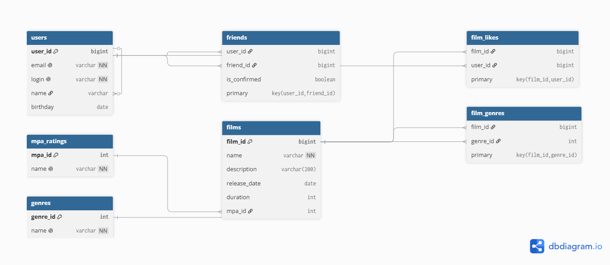

# Filmorate

Приложение для подбора фильмов и формирования социального графа пользователей.

## Схема базы данных



### Пояснение к структуре данных:
* `users` — хранит данные зарегистрированных пользователей.
* `films` — содержит информацию о фильмах и ссылается на возрастные рейтинги.
* `mpa_ratings` — справочник рейтингов ассоциации кинокомпаний (G, PG, PG-13, R, NC-17).
* `genres` — справочник доступных киножанров (Комедия, Драма, Мультфильм, Триллер, Документальный, Боевик).
* `film_genres` — связующая таблица для связи многие-ко-многим между фильмами и жанрами.
* `film_likes` — таблица учета лайков к фильмам от пользователей.
* `friends` — таблица связи пользователей. Поле `is_confirmed` имеет тип `BOOLEAN` (`false` — заявка в друзья отправлена (неподтверждённая), `true` — дружба подтверждена взаимно).

---

## Примеры основных SQL-запросов

### 1. Получение всех фильмов
```sql
SELECT f.film_id, f.name, f.description, f.release_date, f.duration, m.name AS mpa_name
FROM films AS f
LEFT JOIN mpa_ratings AS m ON f.mpa_id = m.mpa_id;
```

### 2. Получение всех пользователей
```sql
SELECT user_id, email, login, name, birthday
FROM users;
```

### 3. Получение топ-N наиболее популярных фильмов
```sql
SELECT f.film_id, f.name, COUNT(fl.user_id) AS likes_count
FROM films AS f
LEFT JOIN film_likes AS fl ON f.film_id = fl.film_id
GROUP BY f.film_id, f.name
ORDER BY likes_count DESC
LIMIT 10;
```

### 4. Нахождение списка общих друзей с другим пользователем (например, для пользователей с id = 1 и id = 2)
```sql
SELECT u.user_id, u.email, u.login, u.name, u.birthday
FROM users AS u
JOIN friends AS f1 ON u.user_id = f1.friend_id AND f1.user_id = 1
JOIN friends AS f2 ON u.user_id = f2.friend_id AND f2.user_id = 2;
```